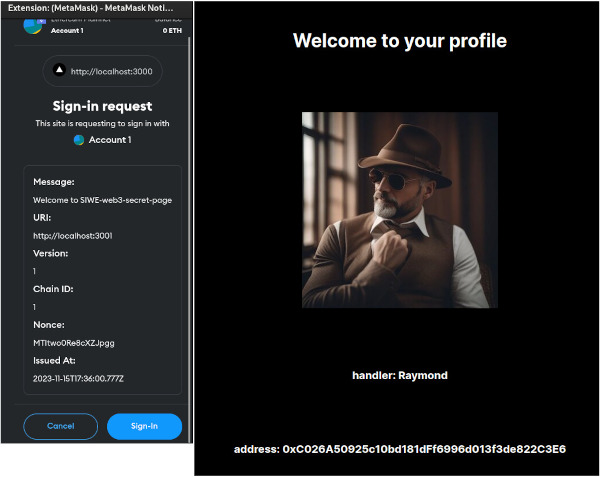

## Description
This is just an example on how to use Ethereum [https://docs.login.xyz/general-information/siwe-overview/eip-4361](SIWE) Authentication to have a secret page in Web3 using [https://nextjs.org/](Nextjs) and [https://metamask.io/](Metamask) Wallet

## Running the backend

```bash
# development
$ cd backend
$ npm install
$ npm run start:dev
```

## Running the frontend
```bash
$ cd frontend
$ npm install
$ npm run dev
```

Open [http://localhost:3000](http://localhost:3000) with your browser to see the frontend.



